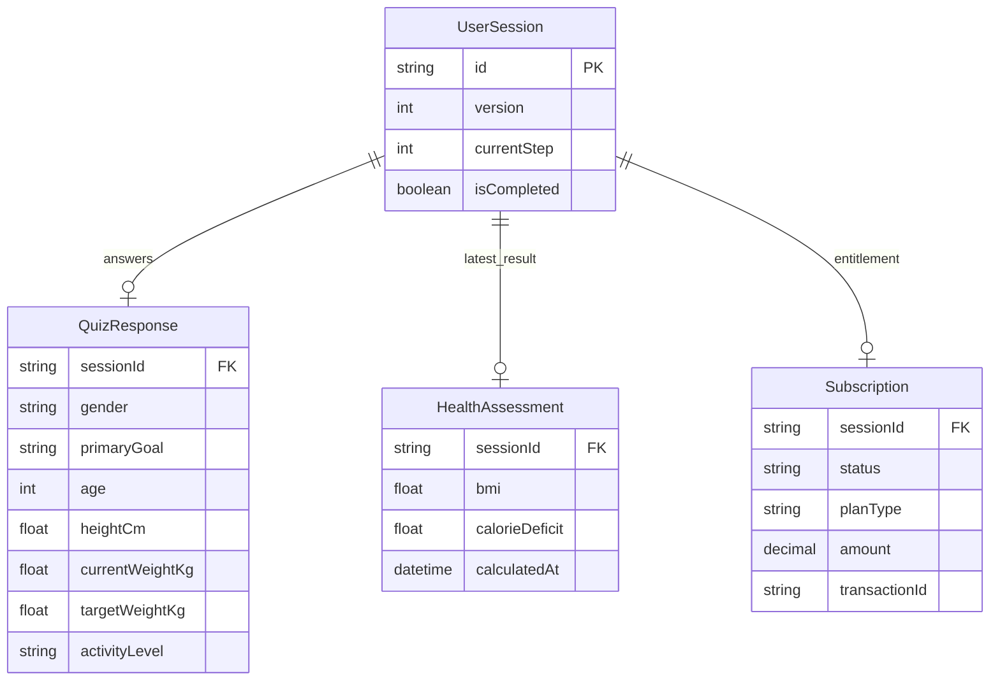

# 睿迄科技健康测评挑战

Next.js 16 App Router + TypeScript + Prisma 6 + PostgreSQL + Vitest + Playwright。

## 交付状态

本仓库包含实现、迁移、测试、API 示例和 AI 协作记录。公网部署地址、GitHub 仓库地址和 GitHub Actions 通过链接**尚未核实**，不将占位 URL 或静态徽章作为交付证据。正式提交前需补齐实际地址并在线验证完整流程。

## 启动

## 线上演示部署（Vercel + PostgreSQL）

本项目需要 Node.js 服务端和 PostgreSQL；不能部署为 GitHub Pages 静态站点。推荐将 GitHub 仓库导入 Vercel，并使用 Neon、Supabase 或 Vercel Postgres 提供生产 PostgreSQL。

**线上演示：<https://arkon-kappa.vercel.app/>**

1. 在 Vercel 导入 `TianyiFan1/Arkon`，Framework 选择 Next.js。
2. 在项目 **Settings → Environment Variables** 添加 `DATABASE_URL`，值为生产 PostgreSQL 的连接字符串；不要使用 `NEXT_PUBLIC_` 前缀。
3. 点击 Deploy。仓库中的 `vercel.json` 会依次执行生产迁移、创建幂等的演示数据、生成 Prisma Client 和 Next.js 构建。
4. 部署完成后，将 Vercel 提供的 `https://…vercel.app` 地址填写到本节顶部和作业提交处，并用该地址从首步走到结果页验证一次。

生产部署会创建以下稳定的演示会话，便于评审直接验证权限差异：

| 状态 | sessionId | 验证方式 |
| --- | --- | --- |
| 已支付会员 | `11111111-2222-4333-8444-555555555555` | `GET /api/quiz/results?sessionId=…` 返回完整 `projectionCurve` 与 `macroSplit`。 |
| 未支付预览 | `99999999-8888-4777-8666-555555555555` | 同一结果接口返回上述字段为 `null`。 |

### 可重放的 /pay 调用

将 `BASE` 替换为实际 Vercel URL。下面命令先读取未支付数据、调用模拟支付、再读取完整数据。调用会改变该会话的状态；如需重复演示，请新建会话并按下方 API 流程保存和计算后再调用 `/pay`。

```sh
BASE="https://arkon-kappa.vercel.app"
SID="99999999-8888-4777-8666-555555555555"

curl "$BASE/api/quiz/results?sessionId=$SID"
curl -X POST "$BASE/api/pay" \
  -H "Content-Type: application/json" \
  -d "{\"sessionId\":\"$SID\",\"planType\":\"MONTHLY\"}"
curl "$BASE/api/quiz/results?sessionId=$SID"
```

需要 Node.js >= 22.12、npm 和 PostgreSQL（本地或 Supabase）。

本机没有 PostgreSQL 时，安装依赖后可运行 `npm run dev:local`：自动启动本机 PostgreSQL、迁移、生成示例数据并打开开发服务。数据保存在系统临时目录下该项目专属的 `arkon-dev-*` 目录，跨重启保留；它是开发环境，重要数据请使用正式 PostgreSQL。默认数据库端口为 55432，可通过 LOCAL_PG_PORT 修改。

```sh
npm ci
# 将 .env.example 复制为 .env，配置 PostgreSQL DATABASE_URL
npm run db:generate
npm run db:migrate
npm run db:seed
npm run dev
```

Windows PowerShell 可用 `Copy-Item .env.example .env`。不要覆盖已有凭据。旧 SQLite 文件不再作为运行数据库，也不会被迁移脚本删除；如需保留旧业务数据，应单独做导入，不能只修改连接字符串。

生产环境配置 PostgreSQL DATABASE_URL，执行 `npm run db:migrate`、`npm run build`，再 `npm start`。迁移已纳入版本管理；不要在生产环境用 db push 代替迁移。Supabase 可使用能执行迁移和事务的直连/会话连接；不要将数据库密钥暴露为 NEXT_PUBLIC 变量。

## 会话与并发规则

- 匿名 sessionId 是本演示的访问凭据，浏览器保存在 localStorage，接口通过 `x-session-id` 或 `sessionId` 查询参数识别。演示未实现真实账号登录。
- 会话初始化、恢复和 PATCH 响应均包含 `version`。
- PATCH 和计算接口必须携带 `expectedVersion`。旧版本的冲突写入返回 409，前端重新读取已保存进度，用户确认后继续。
- 相同字段值的重试不增加版本，不清除现有结果；其他答案修改在同一事务内保存、递增版本、更新进度并删除旧评估。
- PostgreSQL 会话行锁覆盖答案读取、计算、保存、状态变更及结果读取，避免混合不同版本的数据。不同会话不互相持锁。
- 相同答案的重复计算返回原结果，目标日期不会随重试漂移。
- 模拟支付同一套餐重放保留交易号和时间；换套餐时同步更新价格。这里不接入真实支付，不处理真实扣款、退款或续费。

## API 与重放

统一响应为 `{ success: true, data }` 或 `{ success: false, error: { code, message, details? } }`。

| 方法 | 路径 | 请求 / 用途 |
| --- | --- | --- |
| POST | /api/quiz/session | `{}` 创建，或 `{sessionId}` 恢复已有会话 |
| GET | /api/quiz/session | 获取 version、进度、答案和订阅状态 |
| PATCH | /api/quiz/session | `{expectedVersion, ...部分答案}` |
| POST | /api/quiz/calculate | `{expectedVersion}`，按已保存答案计算 |
| GET | /api/quiz/results | 非会员曲线与营养分配为 null；会员返回完整数据 |
| POST | /api/pay | `{sessionId, planType}` 模拟支付 |

下列命令适用于 Bash（PowerShell 可使用 curl.exe 并按其 JSON 引号规则调用）。将 BASE 替换为实际线上域名即可重放。SID 使用第一步返回值，版本以响应为准。

```sh
BASE=http://localhost:3000
curl -X POST "$BASE/api/quiz/session" -H 'Content-Type: application/json' -d '{}'
SID=替换为返回的sessionId
curl -X PATCH "$BASE/api/quiz/session" -H "x-session-id: $SID" -H 'Content-Type: application/json' -d '{"expectedVersion":0,"gender":"MALE","primaryGoal":"LOSE_WEIGHT","age":30,"heightCm":180,"currentWeightKg":85,"targetWeightKg":75,"activityLevel":"LIGHT"}'
curl -X POST "$BASE/api/quiz/calculate" -H "x-session-id: $SID" -H 'Content-Type: application/json' -d '{"expectedVersion":1}'
curl "$BASE/api/quiz/results" -H "x-session-id: $SID"
curl -X POST "$BASE/api/pay" -H 'Content-Type: application/json' -d "{\"sessionId\":\"$SID\",\"planType\":\"MONTHLY\"}"
curl "$BASE/api/quiz/results" -H "x-session-id: $SID"
```

套餐：MONTHLY 29.99 USD、QUARTERLY 59.99 USD、ANNUAL 99.99 USD。

运行 seed 后的已支付 sessionId：`11111111-2222-4333-8444-555555555555`。
未支付示例：`99999999-8888-4777-8666-555555555555`。seed 从正式算法生成结果，重复运行保留已有记录；如果未支付示例已经被支付，请创建新会话重放，不会自动撤销原订阅。

## 算法规则与限制

这是一套演示用估算规则，不是经过临床验证的健康计划。

- BMI 用原始数值分类，显示保留一位小数。
- BMR 使用代码注明的 Mifflin-St Jeor 形式，OTHER 的偏移量是演示假设；活动系数为 1.2 / 1.375 / 1.55 / 1.725。
- 减重摄入量使用 TDEE − 500，并应用原项目的 1200 / 1350 / 1500 配置下限。**这些下限不构成对所有人群的安全保证**。
- 实际热量差始终为 TDEE − 推荐摄入量；没有正缺口时返回 422，不编造减重日期。代谢估算非正数也返回 422。
- 减重日期按体重差 × 7700 / 实际缺口估算；增肌每公斤 21 天为简化假设。曲线为示意插值，末点日期与目标日期一致。
- 维持目标要求目标体重等于当前体重，日期为当前日期。营养分配在总能量预算内计算，整数克数的能量误差最多 2 kcal。
- 单字段边界沿用题目演示实现（年龄 14–120、身高 50–260、体重 20–350），另验证目标关系与目标 BMI。接受字段不意味着此模型适用于该人群；真实产品应单独界定适用人群与临床规则。

## 测试

```sh
npx playwright install chromium
npm test                  # PostgreSQL + Vitest + 生产构建 + 真实 HTTP/浏览器
npm run test:unit          # 仅 PostgreSQL/Vitest 回归
npm run test:browser       # 生产构建 + 真实 HTTP/浏览器
npm run test:coverage      # 全流程，并生成 coverage/ 报告
npm run typecheck
npm run lint
```

本地没有数据库时，测试脚本启动临时 PostgreSQL。可设置 TEST_DATABASE_URL 使用现有测试服务器，该账号需要 CREATE DATABASE 权限。每次测试都创建独立随机命名数据库，结束后删除；**不会清空 DATABASE_URL 指向的开发/生产数据库**。不要绕过包装脚本直接运行 Vitest，测试 setup 会拒绝未隔离环境。

Windows 若已在标准目录安装 Chrome，测试会自动使用它，无需另下载 Chromium；也可通过 PLAYWRIGHT_CHANNEL 指定浏览器。CI 使用 PostgreSQL service 和 Chromium，执行类型检查、lint、覆盖率测试、构建及浏览器验证，并上传报告。只有实际 Actions 成功运行后，才能标注 CI 通过。

| 测试层级 | 覆盖原因与场景 |
| --- | --- |
| 算法 / Schema | 标准值、边界与缺失字段、非法类型、目标冲突、实际缺口、负代谢、营养能量守恒、预测日期一致 |
| PostgreSQL 集成 | 中断恢复、部分字段乱序合并、重复提交、同字段版本冲突、并发更新、计算与修改竞争、事务回滚、订阅价格和支付重放 |
| Route Handler | 不经过网络的接口函数闭环；不称为浏览器 E2E |
| Playwright | 真实服务与浏览器填写、刷新恢复、保存失败不跳步、重复点击、支付后解锁；HTTP 验证冲突、旧结果失效与非法请求 |

尚未覆盖：真实支付网关（本题只模拟支付）、长期负载和跨地域故障、全浏览器兼容矩阵、像素截图回归。代码覆盖率来自运行报告，不硬编码通过率或百分比。

## 数据库 Schema 图

`UserSession` 是匿名用户会话表；`QuizResponse` 保存分步填写的身体数据；`HealthAssessment` 保存服务端计算后的健康评估；`Subscription` 保存模拟支付后的订阅状态。四张表均以 `sessionId` 关联，因此一次测评的进度、结果和会员权限可以一致恢复。



结果采用“每会话最新结果”，答案变更即失效，不声称保留不可变历史快照。金额使用 PostgreSQL Decimal(8,2)，接口转换成 JSON number。

AI 协作记录见 [docs/AI_COLLABORATION.md](docs/AI_COLLABORATION.md)。
